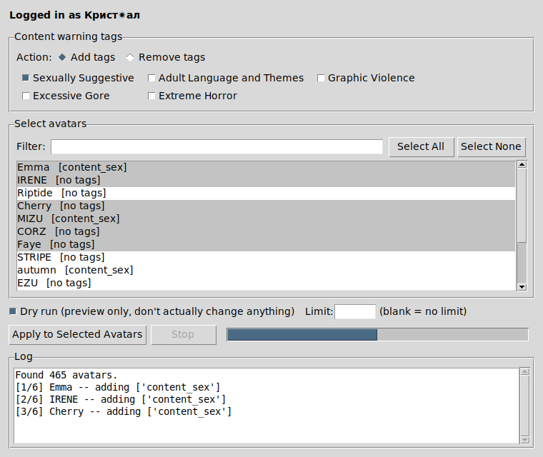

# vrchat-avatar-tagger

A small command-line tool to bulk-apply [VRChat Content Warning tags](https://hello.vrchat.com/creator-guidelines) (Sexually Suggestive, Adult Language and Themes, Graphic Violence, Excessive Gore, Extreme Horror) to **all of your own avatars** at once, instead of clicking through each one individually on the VRChat website.

Useful if you have a large number of avatars and need to get them properly labeled to comply with VRChat's Creator Guidelines and upcoming Content Gating / Age Verification enforcement.

## What it does

- Logs into your VRChat account (supports email and authenticator 2FA)
- Fetches every avatar you own
- Adds the content warning tag(s) you choose to each avatar that doesn't already have them
- **Never removes** any existing tags, content-warning or otherwise

## GUI App (recommended)

If you'd rather not deal with the command line at all, use the desktop app version.

**Windows:** double-click `run_gui.bat` (it installs the one required package automatically the first time).

**Mac/Linux:** run:
```bash
pip install vrchatapi --break-system-packages
python3 tag_avatars_gui.py
```

The app lets you:
- Log in (handles email/authenticator 2FA with a popup)
- Check the box for each content warning tag you want to apply
- See all your avatars in a searchable list and pick exactly which ones to tag (or "Select All")
- Set a limit on how many get tagged in one run
- Preview with "Dry run" before applying anything for real
- Watch a live log and progress bar while it runs, with a Stop button if you change your mind



## Command-line version

If you prefer the terminal or want to script/automate this, use `tag_avatars.py` instead.

### Install

```bash
pip install vrchatapi --break-system-packages
```

(or `pip install -r requirements.txt`)

### Usage

Always preview first with `--dry-run` — it prints exactly what would change without touching your account:

```bash
python3 tag_avatars.py --tags sex --dry-run
```

If that looks right, run it for real:

```bash
python3 tag_avatars.py --tags sex
```

Apply multiple tags at once:

```bash
python3 tag_avatars.py --tags sex,violence,gore
```

See all valid tag names:

```bash
python3 tag_avatars.py --list-tags
```

### Pick specific avatars

Instead of tagging every avatar, use `--select` to get a numbered list you can choose from:

```bash
python3 tag_avatars.py --tags sex --select
```

You'll see something like:

```
    1) Emma  [no tags]
    2) IRENE  [content_violence]
    3) Riptide  [content_sex]
Selection: 1,2,5-10
```

Type comma-separated numbers, ranges (`5-10`), or `all`.

### Cap how many get tagged

Use `--limit` to only tag the first N avatars that need it (handy for testing on a small batch first):

```bash
python3 tag_avatars.py --tags sex --limit 20
```

`--select` and `--limit` can be combined — `--limit` will cap however many you picked.

| Name       | VRChat label                  |
|------------|--------------------------------|
| `sex`      | Sexually Suggestive             |
| `adult`    | Adult Language and Themes       |
| `violence` | Graphic Violence                |
| `gore`     | Excessive Gore                  |
| `horror`   | Extreme Horror                  |

## Notes

- Your username/password are only used locally to log into VRChat's own servers, exactly like the website login. They're entered at runtime (never hardcoded) and nothing is sent anywhere besides VRChat's API.
- After a successful login, the tool saves a session file (`vrchat_session.cookies`) next to the script so re-running it doesn't need a fresh login every time. **Don't share or commit this file** — it's as sensitive as being logged in. It's already excluded via `.gitignore`.
- VRChat limits how many login sessions and requests you can make in a short window. The script pauses briefly between requests; don't remove that.
- This uses [`vrchatapi`](https://github.com/vrchatapi/vrchatapi-python), an unofficial but actively maintained community wrapper around VRChat's API. It isn't officially supported by VRChat.

## License

MIT — see [LICENSE](LICENSE).
